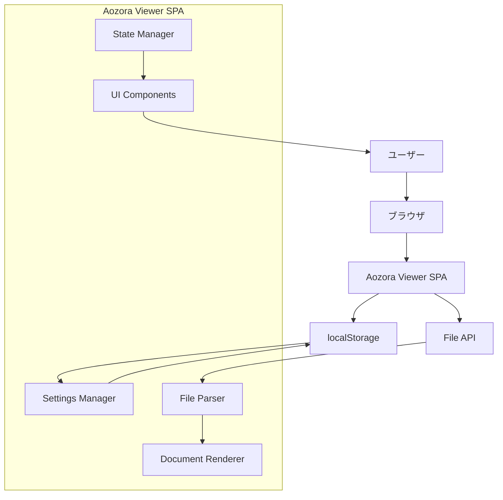
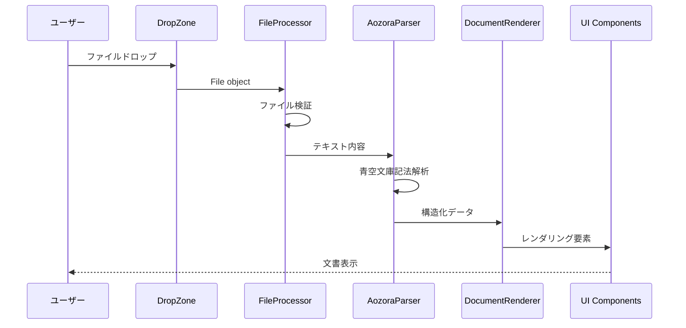
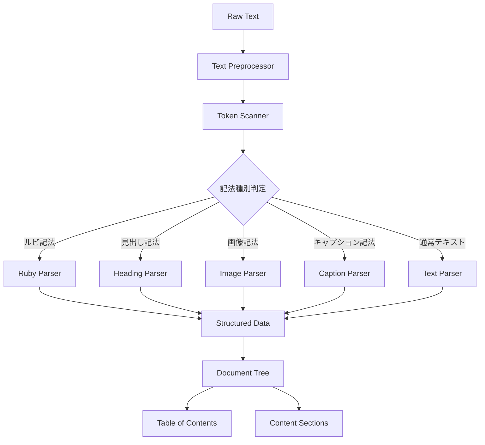
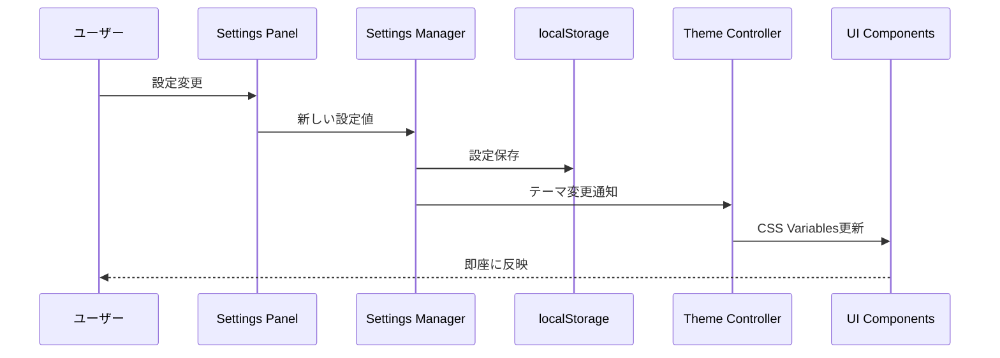
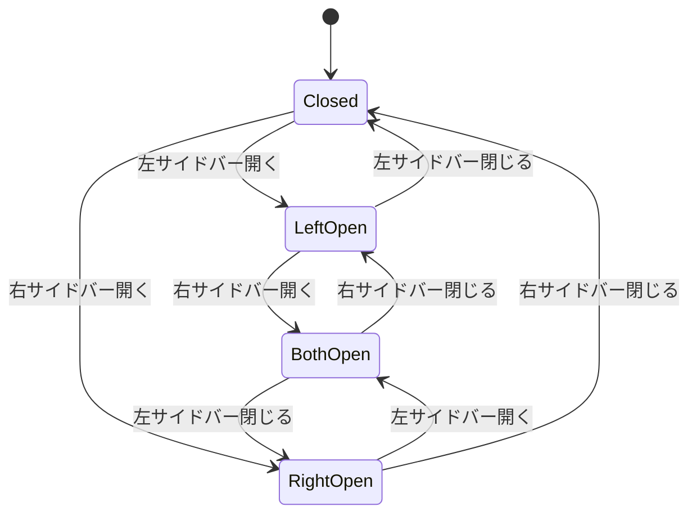
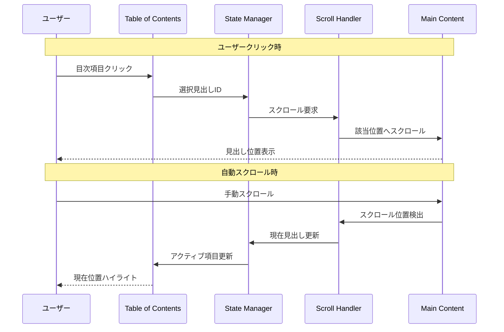
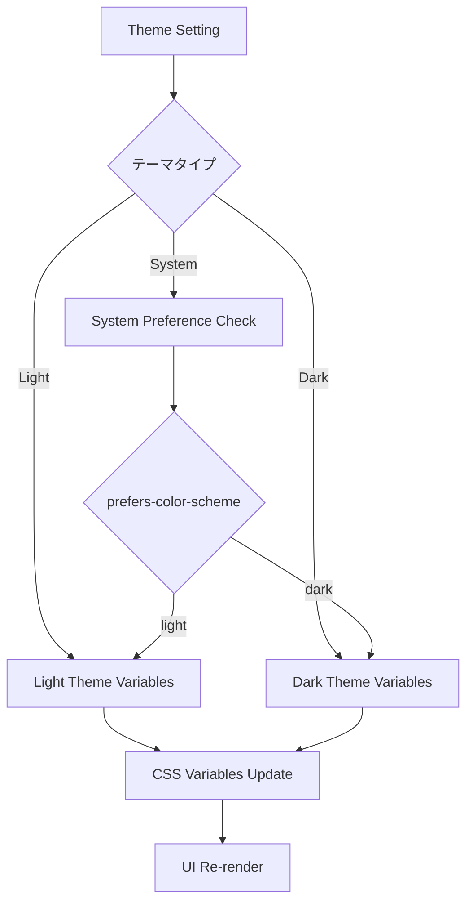
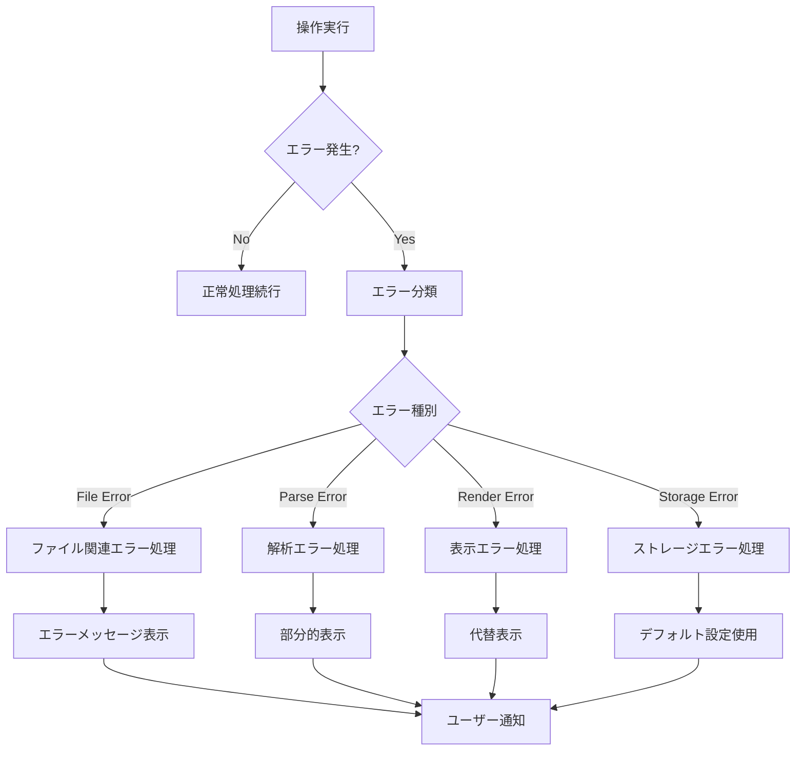
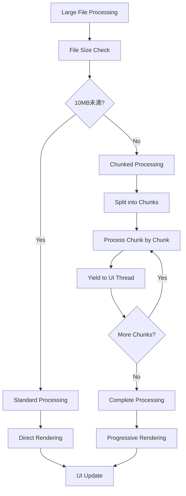
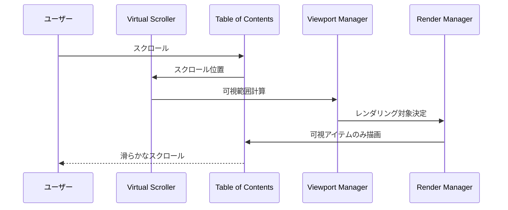

# データフロー図

## 全体システムフロー

```mermaid
flowchart TD
    A[ユーザー] --> B[ブラウザ]
    B --> C[Aozora Viewer SPA]
    C --> D[localStorage]
    C --> E[File API]
    
    subgraph "Aozora Viewer SPA"
        F[File Parser]
        G[Document Renderer]
        H[Settings Manager]
        I[UI Components]
        J[State Manager]
    end
    
    E --> F
    F --> G
    H --> D
    D --> H
    J --> I
    I --> A
```

## ファイル処理フロー

```mermaid
sequenceDiagram
    participant U as ユーザー
    participant DZ as DropZone
    participant FP as FileProcessor
    participant AP as AozoraParser
    participant DR as DocumentRenderer
    participant UI as UI Components
    
    U->>DZ: ファイルドロップ
    DZ->>FP: File object
    FP->>FP: ファイル検証
    FP->>AP: テキスト内容
    AP->>AP: 青空文庫記法解析
    AP->>DR: 構造化データ
    DR->>UI: レンダリング要素
    UI-->>U: 文書表示
```

## 青空文庫記法解析フロー

```mermaid
flowchart TD
    A[Raw Text] --> B[Text Preprocessor]
    B --> C[Token Scanner]
    
    C --> D{記法種別判定}
    
    D -->|ルビ記法| E[Ruby Parser]
    D -->|見出し記法| F[Heading Parser]
    D -->|画像記法| G[Image Parser]
    D -->|キャプション記法| H[Caption Parser]
    D -->|通常テキスト| I[Text Parser]
    
    E --> J[Structured Data]
    F --> J
    G --> J
    H --> J
    I --> J
    
    J --> K[Document Tree]
    K --> L[Table of Contents]
    K --> M[Content Sections]
```

## 設定管理フロー

```mermaid
sequenceDiagram
    participant U as ユーザー
    participant SP as Settings Panel
    participant SM as Settings Manager
    participant LS as localStorage
    participant TC as Theme Controller
    participant UI as UI Components
    
    U->>SP: 設定変更
    SP->>SM: 新しい設定値
    SM->>LS: 設定保存
    SM->>TC: テーマ変更通知
    TC->>UI: CSS Variables更新
    UI-->>U: 即座に反映
```

## サイドバー状態管理フロー

```mermaid
stateDiagram-v2
    [*] --> Closed
    Closed --> LeftOpen : 左サイドバー開く
    Closed --> RightOpen : 右サイドバー開く
    
    LeftOpen --> BothOpen : 右サイドバー開く
    LeftOpen --> Closed : 左サイドバー閉じる
    
    RightOpen --> BothOpen : 左サイドバー開く
    RightOpen --> Closed : 右サイドバー閉じる
    
    BothOpen --> LeftOpen : 右サイドバー閉じる
    BothOpen --> RightOpen : 左サイドバー閉じる
```

## 目次ナビゲーションフロー

```mermaid
sequenceDiagram
    participant U as ユーザー
    participant TOC as Table of Contents
    participant SM as State Manager
    participant SH as Scroll Handler
    participant MC as Main Content
    
    Note over U,MC: ユーザークリック時
    U->>TOC: 目次項目クリック
    TOC->>SM: 選択見出しID
    SM->>SH: スクロール要求
    SH->>MC: 該当位置へスクロール
    MC-->>U: 見出し位置表示
    
    Note over U,MC: 自動スクロール時
    U->>MC: 手動スクロール
    MC->>SH: スクロール位置検出
    SH->>SM: 現在見出し更新
    SM->>TOC: アクティブ項目更新
    TOC-->>U: 現在位置ハイライト
```

## テーマ切り替えフロー

```mermaid
flowchart TD
    A[Theme Setting] --> B{テーマタイプ}
    
    B -->|Light| C[Light Theme Variables]
    B -->|Dark| D[Dark Theme Variables]  
    B -->|System| E[System Preference Check]
    
    E --> F{prefers-color-scheme}
    F -->|light| C
    F -->|dark| D
    
    C --> G[CSS Variables Update]
    D --> G
    G --> H[UI Re-render]
```

## エラー処理フロー

```mermaid
flowchart TD
    A[操作実行] --> B{エラー発生?}
    B -->|No| C[正常処理続行]
    B -->|Yes| D[エラー分類]
    
    D --> E{エラー種別}
    E -->|File Error| F[ファイル関連エラー処理]
    E -->|Parse Error| G[解析エラー処理]
    E -->|Render Error| H[表示エラー処理]
    E -->|Storage Error| I[ストレージエラー処理]
    
    F --> J[エラーメッセージ表示]
    G --> K[部分的表示]
    H --> L[代替表示]
    I --> M[デフォルト設定使用]
    
    J --> N[ユーザー通知]
    K --> N
    L --> N
    M --> N
```

## パフォーマンス最適化フロー

```mermaid
flowchart TD
    A[Large File Processing] --> B[File Size Check]
    B --> C{10MB未満?}
    
    C -->|Yes| D[Standard Processing]
    C -->|No| E[Chunked Processing]
    
    E --> F[Split into Chunks]
    F --> G[Process Chunk by Chunk]
    G --> H[Yield to UI Thread]
    H --> I{More Chunks?}
    I -->|Yes| G
    I -->|No| J[Complete Processing]
    
    D --> K[Direct Rendering]
    J --> L[Progressive Rendering]
    
    K --> M[UI Update]
    L --> M
```

## 仮想スクロール実装フロー（大量見出し対応）

```mermaid
sequenceDiagram
    participant U as ユーザー
    participant VS as Virtual Scroller
    participant TOC as Table of Contents
    participant VM as Viewport Manager
    participant RM as Render Manager
    
    U->>TOC: スクロール
    TOC->>VS: スクロール位置
    VS->>VM: 可視範囲計算
    VM->>RM: レンダリング対象決定
    RM->>TOC: 可視アイテムのみ描画
    TOC-->>U: 滑らかなスクロール
```