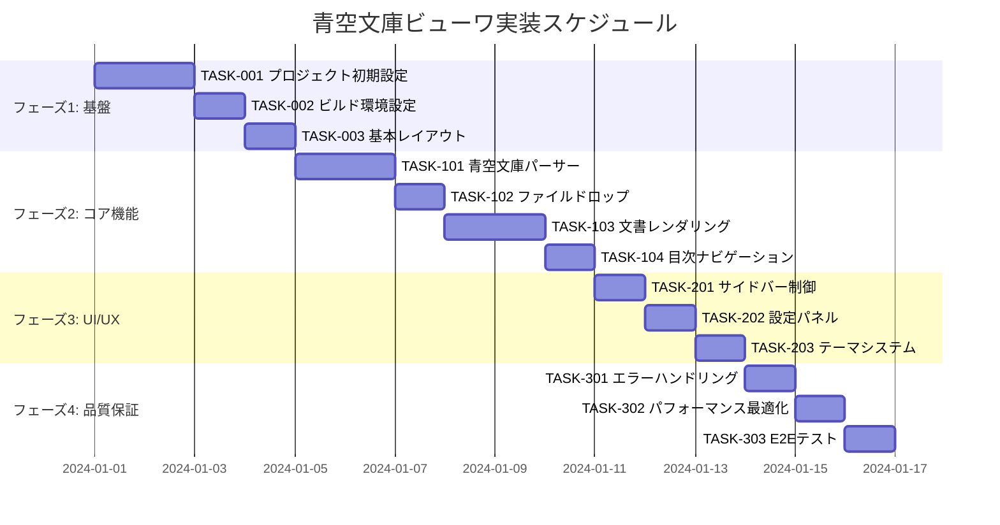

# 青空文庫ビューワ 実装タスク

## 概要

- **全タスク数**: 18
- **推定作業時間**: 32時間
- **クリティカルパス**: TASK-001 → TASK-002 → TASK-003 → TASK-101 → TASK-102 → TASK-201 → TASK-301
- **並行実行可能**: フェーズ2の一部、フェーズ3の一部

## タスク一覧

### フェーズ1: プロジェクト基盤構築 (6時間)

#### TASK-001: プロジェクト初期設定

- [x] **タスク完了**
- **タスクタイプ**: DIRECT
- **要件リンク**: REQ-401 (ブラウザ上で動作)
- **依存タスク**: なし
- **実装詳細**:
  - Vite + React + TypeScript プロジェクト作成
  - ESLint, Prettier 設定
  - package.json の依存関係設定
  - .gitignore 設定
- **完了条件**:
  - [ ] npm run dev でサーバーが起動する
  - [ ] TypeScript strict mode が有効
  - [ ] ESLint エラーがない状態

#### TASK-002: ビルド環境とCI/CD設定

- [x] **タスク完了**
- **タスクタイプ**: DIRECT
- **要件リンク**: NFR-301 (ブラウザ互換性)
- **依存タスク**: TASK-001
- **実装詳細**:
  - Vite ビルド設定（最適化、ポリフィル）
  - GitHub Actions CI/CD パイプライン
  - 静的ホスティング用設定
  - PWA マニフェスト設定
- **テスト要件**:
  - [ ] 本番ビルドが成功する
  - [ ] 各ブラウザでの動作確認
- **完了条件**:
  - [ ] npm run build が成功する
  - [ ] CI/CDパイプラインが動作する

#### TASK-003: 基本UIレイアウトとルーティング

- [x] **タスク完了**
- **タスクタイプ**: TDD
- **要件リンク**: REQ-006, REQ-007 (左右サイドバー)
- **依存タスク**: TASK-002
- **実装詳細**:
  - 基本レイアウトコンポーネント
  - 左右サイドバーの骨組み
  - レスポンシブデザイン基盤
  - CSS Modules + CSS Variables 設定
- **UI/UX要件**:
  - [ ] モバイル対応: ブレークポイント 768px
  - [ ] アクセシビリティ: ARIA landmark roles
  - [ ] テーマ切り替え基盤実装
- **テスト要件**:
  - [ ] コンポーネント単体テスト
  - [ ] レスポンシブ表示テスト
- **完了条件**:
  - [ ] サイドバーが表示される
  - [ ] モバイルで適切に表示される

### フェーズ2: コア機能実装 (18時間)

#### TASK-101: 青空文庫パーサー実装

- [ ] **タスク完了**
- **タスクタイプ**: TDD
- **要件リンク**: REQ-001, REQ-002, REQ-003, REQ-004 (記法解析)
- **依存タスク**: TASK-003
- **実装詳細**:
  - AozoraParser クラス実装
  - ルビ記法 (文字列《ふりがな》) 解析
  - 見出し記法 (［＃「見出し」は大/中/小見出し］) 解析
  - 画像記法とキャプション記法解析
  - エラーハンドリングと部分解析対応
- **テスト要件**:
  - [ ] 単体テスト: 各記法の正確な解析
  - [ ] 単体テスト: 複合記法の処理
  - [ ] 単体テスト: エラー処理（EDGE-004）
  - [ ] 統合テスト: 実際の青空文庫ファイル
- **エラーハンドリング**:
  - [ ] 破損したファイルの部分表示（EDGE-004）
  - [ ] 不正な記法の無視処理
- **完了条件**:
  - [ ] 全記法が正しく解析される
  - [ ] 10MB ファイルを3秒以内に解析

#### TASK-102: ファイルドロップ機能実装

- [ ] **タスク完了**
- **タスクタイプ**: TDD
- **要件リンク**: REQ-005, REQ-101 (ドラッグ&ドロップ)
- **依存タスク**: TASK-101
- **実装詳細**:
  - DropZone コンポーネント実装
  - File API を使用したファイル読み込み
  - ドラッグ&ドロップ視覚的フィードバック
  - ファイル形式検証
- **UI/UX要件**:
  - [ ] ローディング状態: プログレスバー表示
  - [ ] エラー表示: 不正ファイル時のトースト
  - [ ] ドロップエフェクト: 視覚的ハイライト（NFR-101）
  - [ ] モバイル対応: ファイル選択ボタン
- **テスト要件**:
  - [ ] 単体テスト: ファイル検証ロジック
  - [ ] E2Eテスト: ドラッグ&ドロップ操作
  - [ ] エラーテスト: 不正ファイル処理（EDGE-001）
- **エラーハンドリング**:
  - [ ] 不正形式ファイルの適切なメッセージ
  - [ ] サイズ超過時の警告
- **完了条件**:
  - [ ] テキストファイルの正常読み込み
  - [ ] 視覚的フィードバックが動作

#### TASK-103: 文書レンダリングエンジン実装

- [ ] **タスク完了**
- **タスクタイプ**: TDD
- **要件リンク**: REQ-001, REQ-002, REQ-003, REQ-004 (表示)
- **依存タスク**: TASK-102
- **実装詳細**:
  - DocumentRenderer コンポーネント
  - RubyRenderer（ルビ表示）
  - HeadingRenderer（見出し階層表示）
  - ImageRenderer + CaptionRenderer
  - 仮想スクロール対応（100個以上の見出し）
- **UI/UX要件**:
  - [ ] ルビ表示: 正確な位置とサイズ
  - [ ] 見出し表示: 階層的スタイリング
  - [ ] 画像表示: 遅延読み込み対応
  - [ ] アクセシビリティ: セマンティックHTML
- **テスト要件**:
  - [ ] 単体テスト: 各レンダラーコンポーネント
  - [ ] 視覚回帰テスト: スタイル確認
  - [ ] パフォーマンステスト: 大容量ファイル表示
- **完了条件**:
  - [ ] 全記法が美しく表示される
  - [ ] パフォーマンス要件を満たす

#### TASK-104: 目次ナビゲーション実装

- [ ] **タスク完了**
- **タスクタイプ**: TDD
- **要件リンク**: REQ-006, REQ-103, REQ-104 (目次機能)
- **依存タスク**: TASK-103
- **実装詳細**:
  - TableOfContents コンポーネント
  - 見出し階層ツリー表示
  - クリックナビゲーション機能
  - 現在位置の自動追跡
  - 仮想スクロール（EDGE-201対応）
- **UI/UX要件**:
  - [ ] 階層表示: インデント表現
  - [ ] アクティブ状態: 現在位置ハイライト
  - [ ] モバイル対応: タッチ操作最適化
  - [ ] キーボード操作: 矢印キー対応
- **テスト要件**:
  - [ ] 単体テスト: 目次生成ロジック
  - [ ] E2Eテスト: ナビゲーション動作
  - [ ] パフォーマンステスト: 100個以上の見出し
- **完了条件**:
  - [ ] 目次から見出しに移動できる
  - [ ] 現在位置が正確に表示される

### フェーズ3: UI/UX実装 (6時間)

#### TASK-201: サイドバー制御実装

- [ ] **タスク完了**
- **タスクタイプ**: TDD
- **要件リンク**: REQ-105, REQ-202 (サイドバー開閉)
- **依存タスク**: TASK-104
- **実装詳細**:
  - Sidebar コンポーネント（左右共通）
  - 開閉アニメーション
  - 状態管理とlocalStorage保存
  - リサイズ機能
- **UI/UX要件**:
  - [ ] 滑らかなアニメーション: 0.3秒の開閉
  - [ ] トグルボタン: 常に見えるUI
  - [ ] 最小幅確保: 本文領域の確保（EDGE-203）
  - [ ] モバイル対応: オーバーレイ表示
- **テスト要件**:
  - [ ] 単体テスト: 状態変更ロジック
  - [ ] E2Eテスト: 開閉操作
  - [ ] レスポンシブテスト: 画面サイズ対応
- **完了条件**:
  - [ ] 左右サイドバーが独立して開閉
  - [ ] 設定が永続化される

#### TASK-202: 設定パネル実装

- [ ] **タスク完了**
- **タスクタイプ**: TDD
- **要件リンク**: REQ-007, NFR-201〜205 (表示設定)
- **依存タスク**: TASK-201
- **実装詳細**:
  - SettingsPanel コンポーネント
  - 各設定項目（文字サイズ、行間、マージン、文字間）
  - リアルタイムプレビュー
  - 設定リセット機能
- **UI/UX要件**:
  - [ ] スライダー: 直感的な数値調整
  - [ ] プレビュー: 変更の即座反映（NFR-002）
  - [ ] バリデーション: 範囲外値の制限
  - [ ] アクセシビリティ: ラベルとARIA属性
- **テスト要件**:
  - [ ] 単体テスト: 各設定項目の動作
  - [ ] 統合テスト: localStorage保存・復元
  - [ ] UI テスト: スライダー操作
- **完了条件**:
  - [ ] 全設定項目が正常に動作
  - [ ] 1秒以内に表示に反映

#### TASK-203: テーマシステム実装

- [ ] **タスク完了**
- **タスクタイプ**: TDD
- **要件リンク**: REQ-106, NFR-205 (テーマ切り替え)
- **依存タスク**: TASK-202
- **実装詳細**:
  - ThemeProvider コンポーネント
  - CSS Variables による動的テーマ
  - システム設定自動検出
  - テーマ切り替えアニメーション
- **UI/UX要件**:
  - [ ] 3つのテーマ: Light, Dark, System
  - [ ] 滑らかな切り替え: フェード効果
  - [ ] システム連動: prefers-color-scheme 対応
  - [ ] アイコン表示: テーマ状態の視覚的表現
- **テスト要件**:
  - [ ] 単体テスト: テーマ切り替えロジック
  - [ ] E2Eテスト: 各テーマでの表示確認
  - [ ] 統合テスト: システム設定連動
- **完了条件**:
  - [ ] 3つのテーマが正常に動作
  - [ ] システム設定に連動する

### フェーズ4: 統合・品質保証 (2時間)

#### TASK-301: エラーハンドリングと境界ケース対応

- [ ] **タスク完了**
- **タスクタイプ**: TDD
- **要件リンク**: EDGE-001〜004, EDGE-101〜104, EDGE-201〜203
- **依存タスク**: TASK-203
- **実装詳細**:
  - 包括的エラーハンドリング
  - 境界値処理
  - フォールバック機能
  - エラー報告システム
- **UI/UX要件**:
  - [ ] エラートースト: ユーザーフレンドリーなメッセージ
  - [ ] 部分表示: 破損ファイルの対応
  - [ ] プレースホルダ: 画像読み込み失敗時
  - [ ] 復旧機能: 設定リセット等
- **テスト要件**:
  - [ ] エラーケーステスト: 全EDGE項目
  - [ ] 境界値テスト: 最大・最小値
  - [ ] 復旧テスト: エラー後の正常動作
- **完了条件**:
  - [ ] 全エラーケースが適切に処理される
  - [ ] ユーザーがエラーから復旧できる

#### TASK-302: パフォーマンス最適化

- [ ] **タスク完了**
- **タスクタイプ**: DIRECT
- **要件リンク**: NFR-001〜003 (パフォーマンス)
- **依存タスク**: TASK-301
- **実装詳細**:
  - Web Workers による非同期処理
  - React.memo によるレンダリング最適化
  - 遅延読み込み実装
  - メモリリーク対策
- **テスト要件**:
  - [ ] パフォーマンステスト: 3秒以内の初期表示
  - [ ] メモリテスト: 10MBファイル処理
  - [ ] 応答性テスト: 1秒以内の設定反映
- **完了条件**:
  - [ ] 全パフォーマンス要件を満たす
  - [ ] メモリリークがない

#### TASK-303: E2Eテストスイート

- [ ] **タスク完了**
- **タスクタイプ**: DIRECT
- **要件リンク**: 全機能要件の統合確認
- **依存タスク**: TASK-302
- **実装詳細**:
  - Playwright/Cypress セットアップ
  - 主要ユーザーフローテスト
  - クロスブラウザテスト
  - CI/CD統合
- **テスト要件**:
  - [ ] ファイルドロップ〜表示まで
  - [ ] 設定変更〜永続化まで
  - [ ] 全ブラウザでの動作確認
  - [ ] モバイル操作テスト
- **完了条件**:
  - [ ] 全E2Eテストが通る
  - [ ] CI/CDで自動実行される

## 実行順序

## マイルストーン

- **マイルストーン1** (4日目): 基盤完成 - プロジェクト起動、基本レイアウト表示
- **マイルストーン2** (10日目): コア機能完成 - ファイル読み込み、解析、表示が動作
- **マイルストーン3** (13日目): UI完成 - 全機能が利用可能
- **マイルストーン4** (16日目): 品質保証完成 - 本番準備完了

## 注意事項

### TDDプロセス
TDDタスクは以下の順序で実装:
1. `tdd-requirements.md` - 詳細要件定義
2. `tdd-testcases.md` - テストケース作成  
3. `tdd-red.md` - テスト実装（失敗）
4. `tdd-green.md` - 最小実装
5. `tdd-refactor.md` - リファクタリング
6. `tdd-verify-complete.md` - 品質確認

### DIRECTプロセス  
DIRECTタスクは以下の順序で実装:
1. `direct-setup.md` - 直接実装・設定
2. `direct-verify.md` - 動作確認・品質確認

### 並行実行推奨
- TASK-201, TASK-202, TASK-203 は一部並行実行可能
- テスト実装は機能実装と並行実行推奨